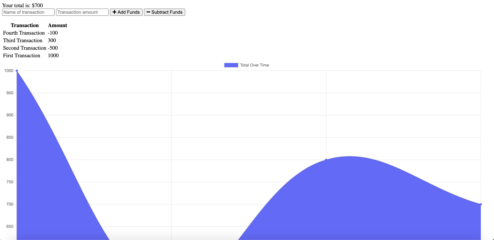

# Budget Tracker

## Description
This application allows the user to track their budget by entering their transactions and seeing a visual representation of it. There is offline functionality so that users can track their transactions without internet connection. However, the total will only be updated when the user is connected to the internet again. This application was built using Express, MongoDB, NoSQL, Mongoose, and IndexedDB.

## Table of Contents
* [Installation](#installation)
* [Application](#application)
* [License](#license)
* [Contributing](#contributing)
* [Questions](#questions)

## Installation

To install neccesary dependencies, run the following command:

```
npm install
```

## Application

To use this application please see the following link: http://anishasnet-budget-tracker.herokuapp.com/
Here is what the page looks like upon loading:


## Usage

To start the server type:

```
node server
```

## License

This project is under no license.

## Contributing

Current Contributors: Anisha Sinha

## Questions

For any further questions please email anishasnet@gmail.com. You can find more of my work at [anishasnet](https://github.com/anishasnet).
    